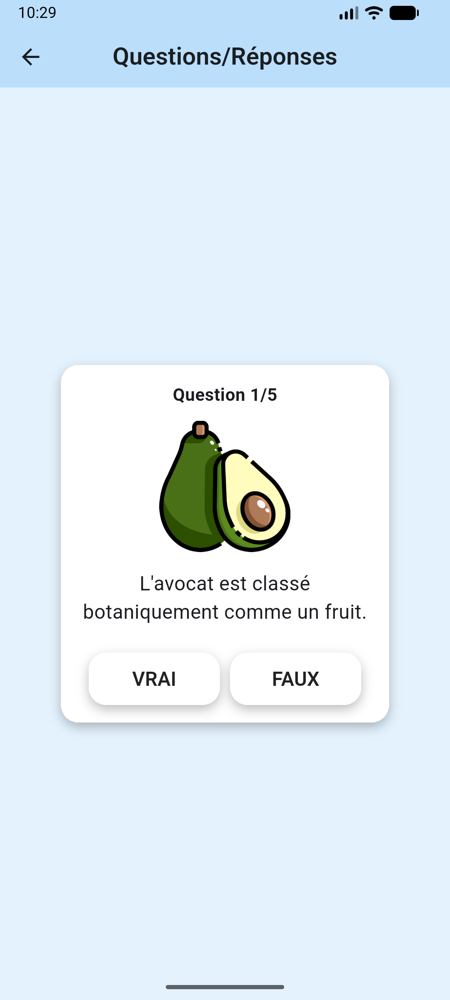
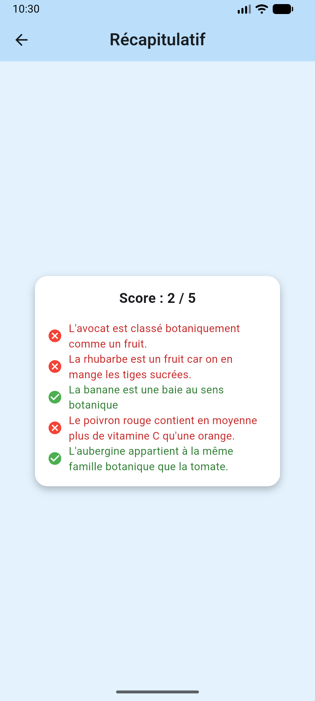

# TP1 Flutter – Carte de profil & Quizz

Ce dépôt contient mon travail pour le TP1 de Flutter.  
L’application est composée de deux parties principales :

- **Une carte de profil** présentant mon avatar, mes informations (nom, formation, contact, réseaux).
- **Un quizz Vrai/Faux** sur le thème des fruits et légumes, illustré par des images.

---

## Fonctionnalités

- Écran d’accueil avec :
  - Avatar et carte de profil.
  - Informations de contact (téléphone, email, LinkedIn, GitHub).
  - Bouton pour accéder au quizz.
- Quizz de 5 questions Vrai/Faux :
  - Chaque question affiche un texte et une image associée (fruit ou légume).
  - Gestion de l’état avec un `StatefulWidget` (`QuizzPage`).
- Page de récapitulatif :
  - Calcul du score.
  - Affichage, pour chaque question, si la réponse était correcte ou non (icône verte/rouge).
- Thème visuel cohérent entre les 3 écrans (profil, quizz, récapitulatif).

---

## Aperçu visuel

L’application se compose de trois écrans principaux :

1. **Page de profil**  
   Carte blanche avec avatar centré, informations personnelles (nom, formation, contact) et un bouton arrondi pour accéder au quizz.

2. **Page de quizz**  
   Carte centrale affichant le numéro de la question, une image de fruit ou de légume (avocat, banane, poivron, etc.), puis la question en texte et deux boutons « VRAI » / « FAUX ».

3. **Page de récapitulatif**  
   Carte blanche montrant le score global (par exemple `4/5`) et une liste de toutes les questions avec, en face de chacune, une icône verte si la réponse est correcte ou rouge sinon.

--

## Captures d’écran

_(Exemples à adapter avec tes vrais fichiers)_

- Page de profil  
  

- Page de quizz  
  

- Page de récapitulatif  
  

--

## Structure du code

- `lib/main.dart`  
  - `MyApp` : widget racine (MaterialApp, thème).  
  - `ProfileHomePage` : page de profil + navigation vers le quizz.

- `lib/quizz.dart`  
  - `Question` : classe modèle (texte, booléen, chemin d’image).  
  - `QuizzPage` / `_QuizzPageState` : logique du quizz et affichage des questions.  
  - `SummaryPage` : affichage du score et du détail des réponses.

---

## Lancer le projet

```bash
flutter pub get
flutter run
```

---

## Ressources graphiques

Toutes les icônes et illustrations (avatar, fruits et légumes) proviennent du site  
[Flaticon](https://www.flaticon.com/fr/), sous licence Flaticon (utilisation gratuite avec attribution).

---
